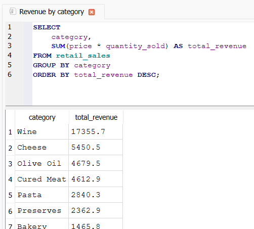
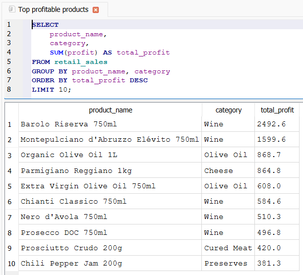
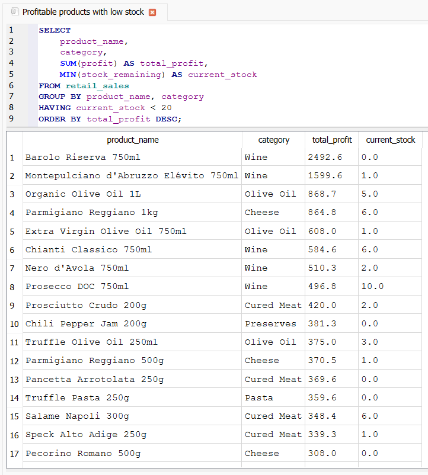
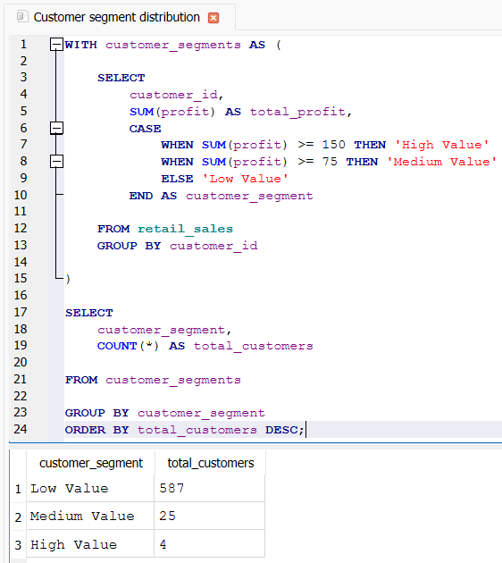

# 🗄️ Retail SQL Analytics

[]()
[]()
[]()

## 📊 Project Overview

An SQL-focused analytics project built to simulate how a Junior Data Analyst would explore business data using a relational database.

The project uses SQLite and SQL to analyze sales performance, customer behavior, product profitability, and inventory management within a retail food and beverage business.

This project extends the analysis performed in the Retail Business Intelligence Dashboard project and focuses specifically on querying, aggregating, and extracting business insights using SQL.

---

## ✨ Project Snapshot

This project was designed as a practical SQL case study covering:

* sales performance analysis
* revenue and profitability analysis
* inventory monitoring
* stock risk identification
* customer analysis and segmentation
* business-oriented querying
* SQL-based reporting
* decision support analysis

The goal was not simply to learn SQL syntax, but to understand how SQL can be used to answer real business questions and support data-driven decisions.

---

## 🎯 Business Problem

Retail businesses need quick answers to questions such as:

* Which categories generate the highest sales volume?
* Which categories produce the highest revenue and profit?
* Which products are the most profitable?
* Which items are at risk of stock depletion?
* Are high-profit products adequately stocked?
* Who are the most valuable customers?
* How can customers be segmented based on profitability?

This project was developed to answer those questions using structured SQL analysis.

---

## 🛠️ Tech Stack

* SQLite
* DB Browser for SQLite
* SQL
* Git
* GitHub
* Visual Studio Code

---

## 🧱 Project Structure

```text
retail-sql-analytics/
│
├── data/
│   └── cleaned_sales_data.csv
│
├── database/
│   └── retail_sales.db
│
├── sql/
│   ├── 01_basic_queries.sql
│   ├── 02_sales_analysis.sql
│   ├── 03_inventory_analysis.sql
│   ├── 04_customer_analysis.sql
│   └── 05_views_and_reporting.sql
│
├── insights/
│   └── business_insights.md
│
├── screenshots/
│
├── README.md
└── .gitignore
```

---

## 📦 Dataset Overview

The dataset contains 1,000 retail transactions and includes:

* Order ID
* Order Date
* Customer ID
* Product Name
* Category
* Price
* Quantity Sold
* Product Cost
* Profit
* Stock Remaining
* Payment Method

The dataset is the same business dataset used in the Retail Business Intelligence Dashboard project, allowing the analysis to be explored from both a SQL and Business Intelligence perspective.

---

## 📈 Analytics Covered

### Sales Analysis

* Sales volume by category
* Revenue by category
* Profit by category
* Top profitable products
* Average profit by category

### Inventory Analysis

* Low-stock products
* Products at risk of stockout
* Average stock by category
* High-profit products with critical stock levels
* Categories with the highest inventory risk

### Customer Analysis

* Most active customers
* Most profitable customers
* Average profit per order
* Customer segmentation
* Customer segment distribution

### SQL Reporting

* Customer segmentation views
* Reusable reporting queries
* CTE-based analysis
* Business-oriented reporting workflows

---

## 🧩 SQL Concepts Covered

* SELECT
* WHERE
* ORDER BY
* GROUP BY
* HAVING
* Aggregate Functions
* DISTINCT
* CASE WHEN
* Common Table Expressions (CTEs)
* Views
* Business-Oriented SQL Reporting

---

## 💡 Key Insights

* Sales volume and profitability do not always move together.
* Wine emerged as the strongest category in terms of revenue and profit.
* Olive Oil generated strong profitability despite relatively low sales volume.
* Several highly profitable products were found to have critically low stock levels.
* Customer value is not determined solely by purchase frequency.
* Customer profitability is highly concentrated among a small segment of customers.
* Inventory monitoring plays a significant role in protecting future revenue.

---

## 🖼️ Analysis Preview

### Revenue Analysis



---

### Top Profitable Products



---

### Inventory Risk Analysis



---

### Customer Segmentation



---

## 🧠 What I Learned

This project helped me practice:

* writing analytical SQL queries
* using aggregate functions
* working with GROUP BY and HAVING
* performing inventory and profitability analysis
* analyzing customer behavior
* using CASE WHEN for segmentation
* creating reusable SQL Views
* working with Common Table Expressions (CTEs)
* translating business questions into SQL queries
* organizing SQL projects professionally with Git and GitHub

---

## 🔮 Future Improvements

Possible future enhancements include:

* Multi-table relational analysis with JOINs
* Advanced customer lifetime value metrics
* Additional KPI reporting views
* Integration with Power BI dashboards
* Automated reporting workflows using Python

---

## 👨‍💻 Author

**Francesco Di Cianni**

Junior Data Analyst Portfolio Project

---

## ⭐ Final Note

This project focuses on practical SQL analytics rather than advanced database engineering.

The objective is to demonstrate how SQL can be used to solve realistic business problems, generate actionable insights, and support decision-making processes within a retail environment.

Together with the Retail Business Intelligence Dashboard project, it forms part of a broader portfolio designed to showcase progressive skills in Data Analytics, Business Intelligence, SQL, and data-driven decision making.
